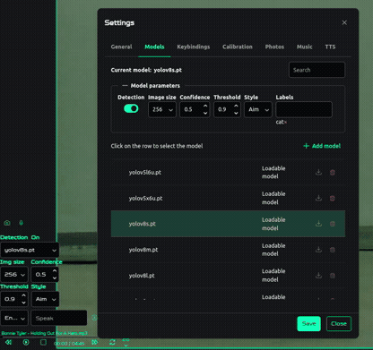

>)    

# Picar-X Racer

**Picar-X Racer** is a robotics and AI platform designed to control the [Picar-X vehicle](https://docs.sunfounder.com/projects/picar-x/en/stable/) on Raspberry Pi. It also supports AI, camera operations, multimedia functionality, and real-time object detection across other Linux-based systems like Ubuntu, with no robot required.


## Features

- Precise control and calibration of the Picar-X vehicle, with smooth, video-game-like responsiveness.
- Real-time object detection using YOLO-based models, with optional [Google Coral](#using-google-coral-accelerator) or [Hailo](#using-hailo-accelerator) accelerators support.
- On-the-fly camera management with `GStreamer`, `v4l2`, `Picamera2` and `libcamera`, allowing seamless swapping between Raspberry Pi Camera Modules 2/3 and USB cameras directly from the UI, without stopping the robot or restarting the application.
- Dynamic model management with support for pretrained YOLO-based models such as Ultralytics, as well as custom models, which can be uploaded and tested in real time without interrupting the running system.
- A standalone web interface for experiments or development, including object detection, video streaming, and data collection, operable independently of the robot.
- Photo capture tools with preview, downloading, and archiving options, useful for organizing data for AI projects.
- Browser compatibility for both desktop and mobile platforms (except Safari on iOS), with extensive customization features.
- Real-time 3D model visualization to monitor the robot's movement and orientation.
- Multimedia features including sound playback, music, and text-to-speech functionality.

<!-- markdown-toc start - Don't edit this section. Run M-x markdown-toc-refresh-toc -->

**Table of Contents**

> - [Picar-X Racer](#picar-x-racer)
>   - [Features](#features)
>   - [Prerequisites](#prerequisites)
>   - [Supported Camera Backends](#supported-camera-backends)
>   - [Raspberry OS Setup](#raspberry-os-setup)
>     - [Installation](#installation)
>     - [Usage](#usage)
>   - [Settings](#settings)
>     - [General](#general)
>     - [Models](#models)
>     - [Keybindings](#keybindings)
>     - [Robot](#robot)
>     - [Text-to-Speech (TTS)](#text-to-speech-tts)
>     - [Music](#music)
>     - [Photos](#photos)
>   - [Object Detection](#object-detection)
>     - [How to Use](#how-to-use)
>     - [Using Custom Models](#using-custom-models)
>     - [Using Hailo Accelerator](#using-hailo-accelerator)
>       - [Configuring Labels](#configuring-labels)
>       - [Image Size Configuration](#image-size-configuration)
>     - [Using Google Coral Accelerator](#using-google-coral-accelerator)
>       - [Google Coral Troubleshooting](#google-coral-troubleshooting)
>   - [Video Enhancers](#video-enhancers)
>     - [Available Enhancement Modes](#available-enhancement-modes)
>     - [How to Use](#how-to-use-1)
>     - [Applications](#applications)
>   - [Avoid Obstacles Mode](#avoid-obstacles-mode)
>   - [Calibration Mode](#calibration-mode)
>     - [3D Virtual Mode](#3d-virtual-mode)
>   - [Development](#development)
>     - [Development Environment Setup](#development-environment-setup)
>     - [Running Tests](#running-tests)
>     - [API Documentation](#api-documentation)
>   - [Project Status](#project-status)

<!-- markdown-toc end -->

## Prerequisites

- Python 3.9-3.12
- Node.js (version 20 or higher)
- make

## Supported Camera Backends

**Picar-X Racer** supports both the **V4L2** and **libcamera** stacks, with the following backends:

- `V4L2` - Uses ioctl for device enumeration and direct video capture.
- `GStreamer` (V4L2 & libcamera) - Interacts directly with GStreamer via PyGObject (gi.repository.Gst), eliminating the need for OpenCV compilation.
- `Picamera2` - Python API for libcamera, optimized for Raspberry Pi.

You can switch between them dynamically.

## Raspberry OS Setup

Before proceeding, install make if it isn’t already installed:

```bash
sudo apt install make
```

Also, ensure that Node.js is installed, as it is used for building the UI.

<details>
  <summary><strong>Install Node.js via NVM (Recommended)</strong></summary>

Using [Node Version Manager (NVM)](https://github.com/nvm-sh/nvm?tab=readme-ov-file#installing-and-updating) is often the easiest and most flexible way to install Node.js. It allows you to easily manage multiple Node.js versions.

1. Install NVM by running the install script:

   ```bash
   wget -qO- https://raw.githubusercontent.com/nvm-sh/nvm/v0.40.1/install.sh | bas
   ```

   Then, restart your shell (or source your profile):

   ```bash
   source ~/.bashrc
   ```

2. Install the desired version of Node.js (for example, the latest LTS version):

   ```bash
   nvm install --lts
   ```

3. Verify the installation:

   ```bash
   node -v
   npm -v
   ```

For more details, refer to the [NVM repository](https://github.com/nvm-sh/nvm).

</details>

<details>
  <summary><strong>Standard Installation without NVM</strong></summary>

You can install Node.js using your package manager. Note that repositories sometimes offer older Node.js versions. To get a recent version, you might want to use NodeSource's binaries.

**Option A: Use your distribution’s package manager (might not be the latest version):**

```bash
sudo apt update
sudo apt install nodejs npm
```

**Option B: Use NodeSource to install a recent version (for example, version 20):**

1.  Add the NodeSource repository:

    ```bash
    curl -fsSL https://deb.nodesource.com/setup_20.x | sudo -E bash -
    ```

2.  Install Node.js:

    ```bash
    sudo apt-get install -y nodejs
    ```

3.  Verify the installation:
    ```bash
    node -v
    npm -v
    ```
    </details>

### Installation

1. Clone this repository to your Raspberry Pi:

   ```bash
   git clone https://github.com/KarimAziev/picar-x-racer.git ~/picar-x-racer/
   ```

2. Navigate to the project directory:

   ```bash
   cd ~/picar-x-racer/
   ```

3. Install dependencies and build the project in a virtual environment.

   ```bash
   make all
   ```

> [!NOTE]
> You may be prompted to enter your password to create a `polkit` rule. This rule allows the application to power off and restart the machine from the UI, as it does not run with `sudo` privileges.
> If you want to skip the creation of the `polkit` rule, run:

```bash
make all INSTALL_FLAGS="--skip-polkit"
```

You can view all available installation options by running:

```bash
make backend-venv-install INSTALL_FLAGS="--help"
```

To preview the installation steps before executing them, run:

```bash
make backend-venv-install INSTALL_FLAGS="--dry-run"
```

That's all! This is a one-time setup.

### Usage

You can launch the project by running the following command in the project directory:

```bash
make backend-venv-run
```

Alternatively, to avoid starting it manually every time, you can run the script below (in the root of the project directory) to configure the application to start automatically upon boot:

```bash
bash ./setup-service.sh
```

Once the application is running, open your browser and navigate to the following URL (replace `<your-raspberry-pi-ip>` with your Raspberry Pi's actual IP address):

```
http://<your-raspberry-pi-ip>:8000
```

After accessing the control interface, you can customize your experience through the settings panel.

## Settings

The **Settings** menu enables you to manage every aspect of your Picar-X Racer experience. It provides extensive customization for multimedia, object detection, keybindings, and much more.

To access settings:

1. Click on the settings icon in the top-left corner of the UI.
2. Alternatively, press:
   - `h` to open general settings.
   - `?` to directly access the keybindings menu.

Here are the key sections of the **Settings** menu:

### General


- Toggle visibility of interface components: gauges, speedometer, 3D car view, object detection panel, etc.
- Configure camera parameters: distance measure delay, video quality, and more.
- Enable or disable advanced features, such as automatic photo downloading and distance measurement.

### Models



You can dynamically manage models either from the settings menu or from the quick panel:

- Load new models on the fly.
- Export models using `export_model.py` and specify the required parameters (e.g., resolution).
- Switch between YOLO models (e.g., `YOLOv8`, `.pt`) or Google Coral `.tflite` models without restarting the server.

### Keybindings

Every function of the car and interface can be mapped to specific keys.

- Default values are provided, but you can edit any setting directly from this tab.
- Alternatively, use the "Shortcuts Settings Menu" on screen (`?`).

### Robot


Robot Configuration includes control settings, calibration, hardware config, pin mapping, etc.

### Text-to-Speech (TTS)


Set up predefined language packs and save custom lines of text for real-time conversion to speech.

### Music

- Upload background tracks or sound effects.
- Manage existing multimedia files via the interface.
- Choose default background music to be played while operating the car.

### Photos

Manage and download photos taken with the Picar-X into your local environment.

## Object Detection


The application integrates object detection capabilities using custom and pretrained machine learning models, allowing to identify and track specific objects in real time.

- **Dynamically load and select YOLO-based models** directly through the interface. Models can be added and configured via the "Available Models" panel.
- Set **confidence thresholds**, **detection styles**, and **labels** flexibly using the detection panel's UI settings.
- Use **Google Coral Accelerator** for better performance on edge devices.
- Export models with different image sizes and specify these sizes in the interface, removing the limitation on model export resolutions.

### How to Use

Follow these steps to enable real-time object detection:

1. Access the **Detection Panel** from the left side of your interface.
2. Use the **"Available Models"** dropdown to select or load your YOLO model.
3. Configure the detection panel with appropriate parameters:
   - **Image size**: Match the size your model expects (e.g., `320`, `640`).
   - **Threshold**: Control overlay synchronization (e.g., `1.2` seconds).
4. Select the **Style** you want for detection overlays and start detection.
   - **Box**: Bounding boxes with class labels and confidence.
   - **Aim**: A minimalistic crosshair over detected objects.
   - **Mixed**: A combination of box annotations and aim visuals.
   - **Pose**: Draws keypoints representing specific body joints without boxes. Requires pose estimation model, i.e. yolo11n-pose.pt.
5. Toggle switch to activate detection.

Output results, such as bounding boxes and labels, will immediately appear on the live camera feed.

### Using Custom Models

You can upload pre-trained YOLO (.pt), Hailo (.hef), or TFLite models for Edge TPU via the UI. Simply click **Add Model**, browse for your file, and verify that the settings correspond to your model's requirements.

> [!NOTE]
> Ensure that the configuration (for example, the image size) matches your model during export or detection, unless you are using a Hailo model (its input shape is extracted automatically).

### Using Hailo Accelerator

If you want to harness the Hailo Accelerator for real-time object detection, you can load your Hailo model (in the `.hef` format) via the UI - just as you would with any custom model.

To use it, simply upload your Hailo model via the **Add Model** button in the UI. Alternatively, you can manually place your model file (ensuring it has a `.hef` extension) into the project's data directory.

#### Configuring Labels

Unlike other models, the Hailo Accelerator requires you to explicitly specify detection labels. By default, the system uses the standard [coco2017](./coco2017.txt) labels. To customize these labels, set the `HAILO_LABELS` environment variable (or configure it in the `.env` file) to point to your custom labels file. If your labels file resides in the project's data directory, you can specify a relative path; otherwise, provide an absolute path.

#### Image Size Configuration

No manual configuration of the image size is required when using a Hailo model - the app automatically reads the model’s native input shape. As a result, any image size settings specified in the UI will be disregarded.

Once loaded, your Hailo-based model will deliver fast and efficient object detection on your Raspberry Pi or other supported platforms.

### Using Google Coral Accelerator

Inference performance directly on the Raspberry Pi can be suboptimal due to limited processing power. A great way to enhance this is by using the **Google Coral Edge TPU** in combination with the Raspberry Pi, which significantly boosts inference speed.

To set up your model with Coral Edge TPU, make sure to follow the [Ultralytics guide](https://docs.ultralytics.com/guides/coral-edge-tpu-on-raspberry-pi/), but take note of specific steps required for exporting your model as a Coral-compatible `.tflite` file.

The image size for the model should be set to `320x320` before exporting to ensure optimal performance on the Coral TPU. You can use our provided `export_model.py` script to assist with exporting your YOLO model for Coral TPU use.

Run the export script as follows:

```sh
cd /path/to/picar-x-racer/backend/
source .venv/bin/activate
pip install tensorflow
python export_model.py
```

For more options, run the script with the help argument:

```bash
python export_model.py --help
```

By default, the script will read from `data/yolov8n.pt` and export the model to `data/yolov8n_full_integer_quant_edgetpu.tflite`. If you're using relative paths for input or output, they will be resolved into the `data/` directory automatically.

For instance:

- Input: `my_model.pt` becomes `/path-to-repo/data/my_model.pt`
- Output: The model will be saved as `/path-to-repo/data/yolov8n_full_integer_quant_edgetpu.tflite`.

You can then copy the exported `.tflite` model to your Picar-X Racer using the following command:

```bash
scp /path/to/picar-x-racer/data/yolov8n_full_integer_quant_edgetpu.tflite pi@raspberrypi.local:/home/pi/picar-x-racer/data/
```

Ensure that `/path/to/picar-x-racer/` is your local project path and `raspberrypi.local` is replaced with your Raspberry Pi's actual hostname or IP address. This loads the Coral Edge TPU-optimized model directly onto the Pi's file system, ready for use.

On the Raspberry Pi, follow these steps to install `tflite-runtime`:

```sh
cd picar-x-racer/backend/
source .venv/bin/activate
pip uninstall tensorflow tensorflow-aarch64
pip install tflite-runtime
```

Then you can run the application. If you encounter errors, such as `Failed to load delegate from libedgetpu.so.1.0 with tflite_runtime`, you may need to download a pre-built wheel that matches your `libedgetpu` version and Python version.

**Steps:**

1. **Identify Python Version:**

   ```bash
   python --version
   ```

   Assume Python 3.10 (`Python 3.10.x`).

2. **Download the Matching tflite-runtime Wheel:**

   From [feranick/TFlite-builds](https://github.com/feranick/TFlite-builds/releases), download the wheel for **TensorFlow Lite Runtime 2.17.0**.

   For Python 3.10 on aarch64:

   ```bash
   wget https://github.com/feranick/TFlite-builds/releases/download/v2.17.0/tflite_runtime-2.17.0-cp310-cp310-linux_aarch64.whl
   ```

3. **Install the Wheel:**

   ```bash
   pip install tflite_runtime-2.17.0-cp310-cp310-linux_aarch64.whl
   ```

> [!IMPORTANT]
> If your Python version or architecture is different, download the appropriate wheel.

#### Google Coral Troubleshooting

If you face issues with recognizing the device, you can try adding the following udev rules and configurations:

**Edit udev rules:**

```sh
sudo nano /etc/udev/rules.d/65-edgetpu.rules
```

**Add:**

```udev
SUBSYSTEM=="apex", GROUP="users", MODE="0660"

# Edge TPU in application mode
SUBSYSTEM=="usb", ATTRS{idVendor}=="1a6e", ATTRS{idProduct}=="089a", \
    ACTION=="bind", RUN+="/sbin/modprobe gasket", RUN+="/sbin/modprobe apex"

# Edge TPU in bootloader mode
SUBSYSTEM=="usb", ATTRS{idVendor}=="18d1", ATTRS{idProduct}=="9302", \
    ACTION=="bind", RUN+="/sbin/modprobe gasket", RUN+="/sbin/modprobe apex"
```

**Reload udev rules:**

```sh
sudo udevadm control --reload-rules
sudo udevadm trigger
sudo usermod -aG plugdev $USER
```

Then reboot.

## Video Enhancers

Enhance your video streaming experience with real-time video effects modes.

### Available Enhancement Modes

- **None**: No enhancement is applied. The standard video feed is displayed.
- **RoboCop Vision**: Simulates the visual effects seen in the RoboCop movies, including grayscale conversion, edge detection, scan lines, targeting reticles, and a heads-up display (HUD) overlay.
- **Predator Vision**: Simulates the thermal vision effect from the Predator movies, applying a thermal color map to highlight heat signatures.
- **Infrared Vision**: Highlights warmer areas in the image to simulate infrared imaging, useful for detecting heat sources.
- **Ultrasonic Vision**: Creates a monochromatic sonar effect by applying edge detection and a bone color map, simulating ultrasonic imaging.

### How to Use

- **Switch Enhancement Modes**: Use the keybindings `e` (Next Enhance Mode) and `E` (Previous Enhance Mode) to cycle through the available video enhancer modes.
- **Real-time Application**: Enhancements are applied in real-time to the live video feed, providing immediate visual feedback.

### Applications

- **Improved Visibility**: Enhance video feed visibility in low-light conditions or high-contrast environments.
- **Edge Detection for Navigation**: Use edge detection modes to assist with navigation and obstacle avoidance.
- **Educational and Research**: Experiment with different image processing techniques for educational purposes or computer vision research.

## Avoid Obstacles Mode

Activates a mode where the car automatically adjusts its movements to avoid obstacles based on distance measurements from a sensor.

## Calibration Mode


While you can calibrate directly in the settings popup, doing so is not very convenient. You can start the calibration either from the settings menu by clicking the "Start calibration" button or by using the keybinding (default is "C").

In this mode, you can adjust the angle for servo direction, camera pan, and camera tilt. Some commands are remapped:

| Original Command Label   | Original Key | New Command Label         | New Command Description                                  |
| ------------------------ | ------------ | ------------------------- | -------------------------------------------------------- |
| Move Left                | `a`          | Decrease Servo Direction  | Decreases the calibration angle for the servo direction. |
| Move Right               | `d`          | Increase Servo Direction  | Increases the calibration angle for the servo direction. |
| Camera Down              | `ArrowDown`  | Decrease Camera Tilt Cali | Decreases the calibration angle for the camera's tilt.   |
| Camera Up                | `ArrowUp`    | Increase Camera Tilt Cali | Increases the calibration angle for the camera's tilt.   |
| Camera Left              | `ArrowLeft`  | Decrease Camera Pan Cali  | Decreases the calibration angle for the camera's pan.    |
| Camera Right             | `ArrowRight` | Increase Camera Pan Cali  | Increases the calibration angle for the camera's pan.    |
| Reset Camera Orientation | `0`          | Reset Calibration         | Resets all calibration settings.                         |

### 3D Virtual Mode


Hides a video stream view and focuses on controlling the car using just a 3D model visualization.
The mode is supposed to be used with active Auto Measure Distance Mode, which activates the ultrasonic measurement, and the 3D visualization will visualize the ultrasonic distance.

## Development

### Development Environment Setup

To install dependencies, run:

```bash
make frontend-install backend-venv-install
```

To start both the backend and frontend servers in watch mode (automatically reloading on file save), run:

```bash
make dev
```

### Running Tests

Run the following command to execute the tests:

```bash
make tests
```

### API Documentation

You can access the API documentation at:

- `http://<your-raspberry-pi-ip>:8000/docs` or `http://<your-raspberry-pi-ip>:8000/redoc`
- `http://<your-raspberry-pi-ip>:8001/docs` or `http://<your-raspberry-pi-ip>:8001/redoc` (for the car control server)

Two servers are used, with the car control server running in a separate process from the main server to ensure that control operations are never blocked.

## Project Status

This project is a work in progress. New features and improvements are being continuously added.
