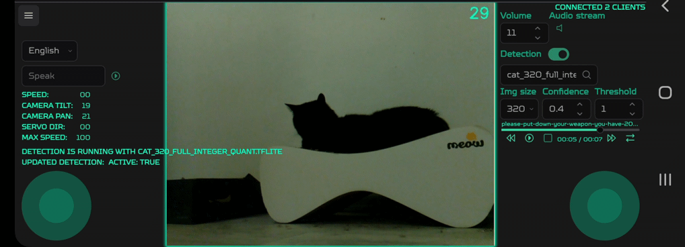
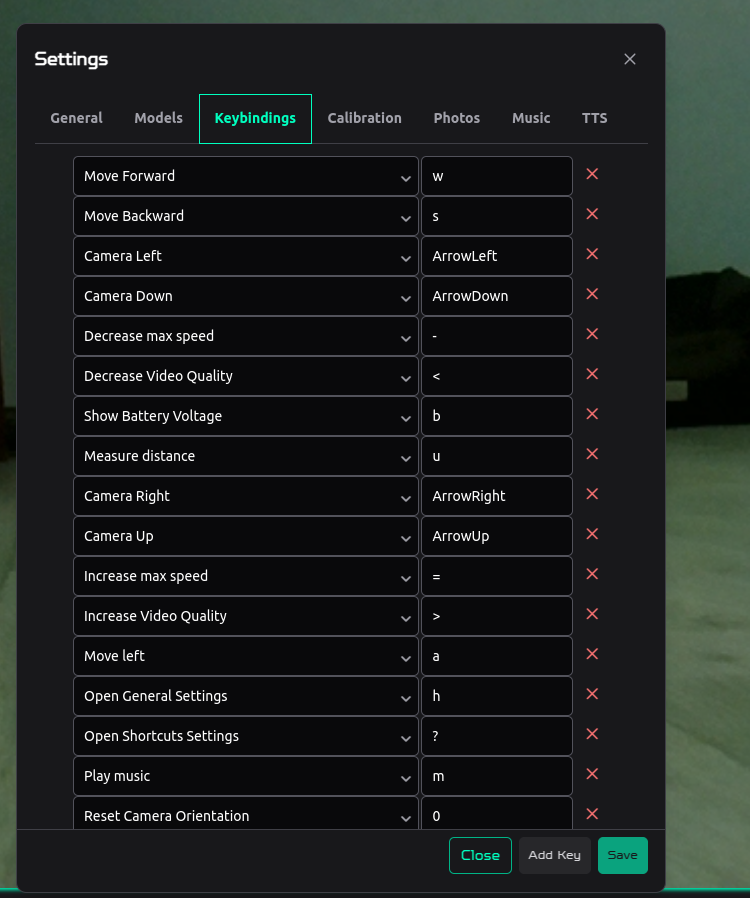

# Picar-X Racer

`Picar-X Racer` is a project aimed at controlling the [Picar-X vehicle](https://docs.sunfounder.com/projects/picar-x/en/stable/) using a modern web interface inspired by racing video games. It integrates both frontend and backend components to manage the car's movement, camera, object detection with AI, and other functionalities. The new interface includes a speedometer, live camera feed, and multimedia controls.




## Features

- **Real-time Control with Video Game-like Precision**: Experience smooth and responsive control over your Picar-X car, similar to a video game interface.
- **Advanced Object Detection with AI**: Integrate AI-powered [object detection modes](#object-detection) to recognize and track objects like cats, persons, and more in real-time. Google Coral accelerator is also [supported](#using-google-coral-accelerator).
- **Dynamic Video Enhancements**: Apply various [video enhancements](#video-enhancers) to your live camera feed.
- **Smooth Calibration**: Quickly switch to the [calibration mode](#calibration-mode) and adjust the settings.
- **Acceleration and Speed Indicators**: Realistic acceleration, speed indicators, and smooth driving experience make navigating through tight spaces easy.
- **Full Customization**: Change every shortcut, panel view, and more.
- **Multimedia Functionality**: Play sounds and music, and convert text to speech for interactive experiences.
- **3D Car Visualization**: A real-time 3D model of the Picar-X that reflects and displays the car's angles, providing an enhanced visual control experience.


<!-- markdown-toc start - Don't edit this section. Run M-x markdown-toc-refresh-toc -->

**Table of Contents**

> - [Picar-X Racer](#picar-x-racer)
>   - [Features](#features)
>   - [Prerequisites](#prerequisites)
>   - [Raspberry OS Setup](#raspberry-os-setup)
>     - [Installation](#installation)
>     - [Usage](#usage)
>   - [Settings](#settings)
>     - [Default Keybindings](#default-keybindings)
>   - [Modes](#modes)
>     - [Object Detection](#object-detection)
>       - [Available Detection Modes](#available-detection-modes)
>         - [How to Use](#how-to-use)
>         - [Using Custom Models](#using-custom-models)
>         - [Using Google Coral Accelerator](#using-google-coral-accelerator)
>         - [Google Coral Troubleshooting](#google-coral-troubleshooting)
>     - [Video Enhancers](#video-enhancers)
>       - [Available Enhancement Modes](#available-enhancement-modes)
>       - [How to Use](#how-to-use-1)
>       - [Applications](#applications)
>     - [Avoid Obstacles Mode](#avoid-obstacles-mode)
>     - [Calibration Mode](#calibration-mode)
>     - [3D Virtual Mode](#3d-virtual-mode)
>   - [Development on Non-Raspberry OS](#development-on-non-raspberry-os)
>     - [Backend](#backend)
>       - [Documentation](#documentation)
>     - [Makefile Usage](#makefile-usage)
>       - [Development Environment Setup](#development-environment-setup)
>   - [Project Status](#project-status)

<!-- markdown-toc end -->

## Prerequisites

- Python 3.10
- Node.js and npm
- make

## Raspberry OS Setup

The `bullseye` version of Raspberry Pi OS has Python 3.9 preinstalled. However, since we need Python 3.10, the easiest way to install it is with [Pyenv](https://github.com/pyenv/pyenv).

```
pyenv install 3.10
```

You can optionally make it the default:

```
pyenv global 3.10
```

This project uses neither `Picamera` nor `Picamera 2`; instead, it uses `OpenCV`. `Picamera` is much slower than `OpenCV`, which directly accesses the `/dev/video0` device to grab frames. To access the camera, you need to edit a configuration file in the boot partition of the Raspberry Pi:

- If you are using the `bullseye` version of Raspberry Pi OS, the configuration file is located at `/boot/config.txt`.
- If you are using the `bookworm` version, it is located at `/boot/firmware/config.txt`.

In this file, you need to add the following lines:

```
# Disable the automatic detection of the camera
camera_auto_detect=0

# Enable the camera
start_x=1

# Set GPU memory allocation (in megabytes)
gpu_mem=128

# Enable the VC4 graphics driver for KMS (Kernel Mode Setting)
dtoverlay=vc4-kms-v3d
```

By default, the config file contains the line `camera_auto_detect=1`. Either comment it out or replace it with `camera_auto_detect=0`.

> [!WARNING]
> These settings will make `libcamera-hello` unusable.

Next, to make building and running the project easier, you should install `make` if you don't have it already:

```bash
sudo apt install make
```

### Installation

1. Clone this repository to your Raspberry Pi:

```bash
git clone https://github.com/KarimAziev/picar-x-racer.git ~/picar-x-racer/
```

2. Go to the project directory:

```bash
cd ~/picar-x-racer/
```

3. Install dependencies and build the project in a virtual environment:

```bash
make all
```

That's all. This is a one-time setup. You can then run the project by running the following command in the project directory:

```bash
make backend-venv-run
```

### Usage

In the project root directory, run the script to start the server:

```bash
make backend-venv-run
```

Once the application is running, open your browser and navigate to (replace `<your-raspberry-pi-ip>` with the actual IP):

```
http://<your-raspberry-pi-ip>:8000
```

After navigating to the control interface, you can customize your experience via the comprehensive settings panel.

## Settings

To access settings, press the icon in the top right corner, or press `h` to open the general settings, or `?` to open keybindings settings.


- **Text-to-Speech**: Configure the default text that will be converted into speech.
- **Default Sound**: Select a default sound from the available list to play during specific events.
- **Sounds**: Upload new sound files and manage existing ones.
- **Default Music**: Choose default background music from the available list.
- **Music**: Upload new music files and manage existing ones.
- **Photos**: Manage and download photos captured by the Picar-X camera.
- **Keybindings**: Change all keybindings.
- **Calibration**: Start calibration mode.



### Default Keybindings

In the browser, you can control your Picar-X with the following keys (all the keys can be changed in the settings).

| Label                             | Default Key  | Description                                                                            |     |
| --------------------------------- | ------------ | -------------------------------------------------------------------------------------- | --- |
| Move Forward                      | `w`          | Accelerates the car forward.                                                           |     |
| Move Backward                     | `s`          | Accelerates the car backward.                                                          |     |
| Move Left                         | `a`          | Turns the car left.                                                                    |     |
| Move Right                        | `d`          | Turns the car right.                                                                   |     |
| Stop                              | `Space`      | Stops the car.                                                                         |     |
| Camera Left                       | `ArrowLeft`  | Pans the camera to the left.                                                           |     |
| Camera Down                       | `ArrowDown`  | Tilts the camera downward.                                                             |     |
| Camera Right                      | `ArrowRight` | Pans the camera to the right.                                                          |     |
| Camera Up                         | `ArrowUp`    | Tilts the camera upward.                                                               |     |
| Decrease Max Speed                | `-`          | Decreases the car's maximum speed.                                                     |     |
| Increase Max Speed                | `=`          | Increases the car's maximum speed.                                                     |     |
| Measure Distance                  | `u`          | Measures the distance to obstacles.                                                    |     |
| Play Music                        | `m`          | Plays music.                                                                           |     |
| Play Next Music Track             | `2`          | Plays the next music track.                                                            |     |
| Play Previous Music Track         | `1`          | Plays the previous music track.                                                        |     |
| Play Sound                        | `o`          | Plays a sound.                                                                         |     |
| Reset Camera Orientation          | `0`          | Resets the camera's pan and tilt to the default orientation.                           |     |
| Say Text                          | `k`          | Speaks a predefined text.                                                              |     |
| Next Text                         | `4`          | Selects the next saved text for speech without speaking.                               |     |
| Previous Text                     | `3`          | Selects the previous saved text for speech without speaking.                           |     |
| Take Photo                        | `t`          | Captures a photo using the camera.                                                     |     |
| Next Enhance Mode                 | `e`          | Cycles to the next video enhancement mode. [See details](#video-enhancers)             |     |
| Previous Enhance Mode             | `E`          | Cycles to the previous video enhancement mode. [See details](#video-enhancers)         |     |
| Next Detect Mode                  | `r`          | Cycles to the next AI detection mode. [See details](#object-detection)                 |     |
| Previous Detect Mode              | `R`          | Cycles to the previous AI detection mode. [See details](#object-detection)             |     |
| Show Battery Voltage              | `b`          | Displays the current battery voltage.                                                  |     |
| Toggle Fullscreen                 | `f`          | Enters or exits full-screen mode.                                                      |     |
| Open Shortcuts Settings           | `?`          | Opens the settings menu for keyboard shortcuts.                                        |     |
| Open General Settings             | `h`          | Opens the general settings menu.                                                       |     |
| Increase Video Quality            | `.`          | Increases the video quality.                                                           |     |
| Decrease Video Quality            | `,`          | Decreases the video quality.                                                           |     |
| Increase Video Quality            | `PageUp`     | Increases the video quality.                                                           |     |
| Decrease Video Quality            | `PageDown`   | Decreases the video quality.                                                           |     |
| Toggle Speedometer View           | `N`          | Toggles the speedometer display on or off.                                             |     |
| Toggle 3D Car View                | `M`          | Toggles the 3D view of the car on or off.                                              |     |
| Toggle Text Info                  | `I`          | Toggles text information on or off.                                                    |     |
| Toggle Calibration Mode           | `C`          | Toggles calibration mode. [See details](#calibration-mode)                             |     |
| Toggle Auto Downloading Photo     | `P`          | Toggles automatic downloading of captured photos.                                      |     |
| Toggle 3D Virtual Mode            | `*`          | Activates virtual mode. [See details](#3d-virtual-mode)                                |     |
| Toggle Auto Measure Distance Mode | `U`          | Toggles automatic distance measurement.                                                |     |
| Increase FPS                      | `F`          | Increases the frames per second.                                                       |     |
| Decrease FPS                      | `S`          | Decreases the frames per second.                                                       |     |
| Increase Dimension                | `]`          | Increases the display dimensions.                                                      |     |
| Decrease Dimension                | `[`          | Decreases the display dimensions.                                                      |     |
| Increase Volume                   | `PageUp`     | Increases the audio volume.                                                            |     |
| Decrease Volume                   | `PageDown`   | Decreases the audio volume.                                                            |     |
| Toggle Avoid Obstacles Mode       | `O`          | Toggles a mode to automatically avoid obstacles. [See details](#avoid-obstacles-mode). |     |

## Modes

### Object Detection


Leverage AI-powered object detection modes to enhance your driving and monitoring experience. The Picar-X Racer integrates object detection capabilities using machine learning models to identify and track specific objects in real-time.

#### Available Detection Modes

- **None**: Detection is disabled. The car streams the standard video feed without any overlays.
- **All**: Detects all objects recognized by the AI model and overlays bounding boxes with labels.
- **Person**: Specifically detects human figures and tracks them.
- **Cat**: Specifically detects cats and tracks them.

##### How to Use

- **Switch Detection Modes**: Use the keybindings `r` (Next Detect Mode) and `R` (Previous Detect Mode) to cycle through the available detection modes.
- **Overlay Information**: When a detection mode is active, the live video feed will display bounding boxes and labels around the detected objects.
- **Applications**: Use object detection to avoid obstacles, follow subjects, or gather data about the environment.

In the settings, you can specify the desired confidence level of the model.

##### Using Custom Models

By default, the object detection feature uses the `YOLOv8n` model, which is optimized for real-time processing on devices like the Raspberry Pi. However, you can specify custom model paths using environment variables, enabling greater flexibility.

**Using Terminal:**

To set a custom model, specify the `YOLO_MODEL_PATH` environment variable with the path to the model.

If you are using a **relative path**, your model path will be resolved to the `data/` directory within the project root directory. For example:

```sh
export YOLO_MODEL_PATH=my_custom_model.pt
```

This will resolve to:
`/path-to-repo/data/my_custom_model.pt`

On the other hand, **absolute paths** can be provided directly and will be used as-is:

```sh
export YOLO_MODEL_PATH=/path/to/your/custom_model.pt
```

Similarly, if using a **model optimized for the Coral Edge TPU**, you can set the `YOLO_MODEL_EDGE_TPU_PATH` environment variable to point to the `.tflite` model file:

```sh
export YOLO_MODEL_EDGE_TPU_PATH=/path/to/your/custom_edgetpu_model.tflite
```

**Using `.env` file**

You can also configure these environment variables using a `.env` file in the backend directory of this repository. This method is useful for maintaining persistent configurations. See the [.env.example](./backend/.env.example) file provided in the repository for guidance.

For example:

```sh
# In your .env file:
YOLO_MODEL_PATH=my_custom_model.pt
YOLO_MODEL_EDGE_TPU_PATH=/path/to/your_custom_edgetpu_model.tflite
```

Any relative model paths mentioned here will also be resolved within the `data/` directory.

---

##### Using Google Coral Accelerator

Inference performance directly on the Raspberry Pi can be suboptimal due to limited processing power. A great way to enhance this is by using the **Google Coral Edge TPU** in combination with the Raspberry Pi, which significantly boosts inference speed.

To set up your model with Coral Edge TPU, make sure to follow the [Ultralytics guide](https://docs.ultralytics.com/guides/coral-edge-tpu-on-raspberry-pi/), but take note of specific steps required for exporting your model as a Coral-compatible `.tflite` file.

The image size for the model should be set to `320x320` before exporting to ensure optimal performance on the Coral TPU. You can use our provided `export_model.py` script to assist with exporting your YOLO model for Coral TPU use.

Run the export script as follows:

```sh
cd /path/to/picar-x-racer/backend/
source .venv/bin/activate
pip install tensorflow
python export_model.py
```

For more options, run the script with the help argument:

```bash
python export_model.py --help
```

By default, the script will read from `data/yolov8n.pt` and export the model to `data/yolov8n_full_integer_quant_edgetpu.tflite`. If you're using relative paths for input or output, they will be resolved into the `data/` directory automatically.

For instance:

- Input: `my_model.pt` becomes `/path-to-repo/data/my_model.pt`
- Output: The model will be saved as `/path-to-repo/data/yolov8n_full_integer_quant_edgetpu.tflite`.

You can then copy the exported `.tflite` model to your Picar-X Racer using the following command:

```bash
scp /path/to/picar-x-racer/data/yolov8n_full_integer_quant_edgetpu.tflite pi@raspberrypi.local:/home/pi/picar-x-racer/data/
```

Ensure that `/path/to/picar-x-racer/` is your local project path and `raspberrypi.local` is replaced with your Raspberry Pi's actual hostname or IP address. This loads the Coral Edge TPU-optimized model directly onto the Pi's file system, ready for use.

On the Raspberry Pi, follow these steps to install `tflite-runtime`:

```sh
cd picar-x-racer/backend/
source .venv/bin/activate
pip uninstall tensorflow tensorflow-aarch64
pip install tflite-runtime
```

Then you can run the application. If you encounter errors, such as `Failed to load delegate from libedgetpu.so.1.0 with tflite_runtime`, you may need to download a pre-built wheel that matches your `libedgetpu` version and Python version.

**Steps:**

1. **Identify Python Version:**

   ```bash
   python --version
   ```

   Assume Python 3.10 (`Python 3.10.x`).

2. **Download the Matching tflite-runtime Wheel:**

   From [feranick/TFlite-builds](https://github.com/feranick/TFlite-builds/releases), download the wheel for **TensorFlow Lite Runtime 2.17.0**.

   For Python 3.10 on aarch64:

   ```bash
   wget https://github.com/feranick/TFlite-builds/releases/download/v2.17.0/tflite_runtime-2.17.0-cp310-cp310-linux_aarch64.whl
   ```

3. **Install the Wheel:**

   ```bash
   pip install tflite_runtime-2.17.0-cp310-cp310-linux_aarch64.whl
   ```

> [!IMPORTANT]
> If your Python version or architecture is different, download the appropriate wheel.

##### Google Coral Troubleshooting

If you face issues with recognizing the device, you can try adding the following udev rules and configurations:

**Edit udev rules:**

```sh
sudo nano /etc/udev/rules.d/65-edgetpu.rules
```

**Add:**

```udev
SUBSYSTEM=="apex", GROUP="users", MODE="0660"

# Edge TPU in application mode
SUBSYSTEM=="usb", ATTRS{idVendor}=="1a6e", ATTRS{idProduct}=="089a", \
    ACTION=="bind", RUN+="/sbin/modprobe gasket", RUN+="/sbin/modprobe apex"

# Edge TPU in bootloader mode
SUBSYSTEM=="usb", ATTRS{idVendor}=="18d1", ATTRS{idProduct}=="9302", \
    ACTION=="bind", RUN+="/sbin/modprobe gasket", RUN+="/sbin/modprobe apex"
```

**Reload udev rules:**

```sh
sudo udevadm control --reload-rules
sudo udevadm trigger
sudo usermod -aG plugdev $USER
```

Then reboot.

### Video Enhancers

Enhance your video streaming experience with real-time video enhancement modes.

#### Available Enhancement Modes

- **None**: No enhancement is applied. The standard video feed is displayed.
- **RoboCop Vision**: Simulates the visual effects seen in the RoboCop movies, including grayscale conversion, edge detection, scan lines, targeting reticles, and a heads-up display (HUD) overlay.
- **Predator Vision**: Simulates the thermal vision effect from the Predator movies, applying a thermal color map to highlight heat signatures.
- **Infrared Vision**: Highlights warmer areas in the image to simulate infrared imaging, useful for detecting heat sources.
- **Ultrasonic Vision**: Creates a monochromatic sonar effect by applying edge detection and a bone color map, simulating ultrasonic imaging.

#### How to Use

- **Switch Enhancement Modes**: Use the keybindings `e` (Next Enhance Mode) and `E` (Previous Enhance Mode) to cycle through the available video enhancer modes.
- **Real-time Application**: Enhancements are applied in real-time to the live video feed, providing immediate visual feedback.

#### Applications

- **Improved Visibility**: Enhance video feed visibility in low-light conditions or high-contrast environments.
- **Edge Detection for Navigation**: Use edge detection modes to assist with navigation and obstacle avoidance.
- **Educational and Research**: Experiment with different image processing techniques for educational purposes or computer vision research.

### Avoid Obstacles Mode

Activates a mode where the car automatically adjusts its movements to avoid obstacles based on distance measurements from a sensor.

### Calibration Mode

Activates a mode for calibration. In this mode, you can adjust the angle for servo direction, camera pan, and camera tilt. Some commands are remapped:

| Original Command Label   | Original Key | New Command Label         | New Command Description                                  |
| ------------------------ | ------------ | ------------------------- | -------------------------------------------------------- |
| Move Left                | `a`          | Decrease Servo Direction  | Decreases the calibration angle for the servo direction. |
| Move Right               | `d`          | Increase Servo Direction  | Increases the calibration angle for the servo direction. |
| Camera Down              | `ArrowDown`  | Decrease Camera Tilt Cali | Decreases the calibration angle for the camera's tilt.   |
| Camera Up                | `ArrowUp`    | Increase Camera Tilt Cali | Increases the calibration angle for the camera's tilt.   |
| Camera Left              | `ArrowLeft`  | Decrease Camera Pan Cali  | Decreases the calibration angle for the camera's pan.    |
| Camera Right             | `ArrowRight` | Increase Camera Pan Cali  | Increases the calibration angle for the camera's pan.    |
| Reset Camera Orientation | `0`          | Reset Calibration         | Resets all calibration settings.                         |

### 3D Virtual Mode


Hides a video stream view and focuses on controlling the car using just a 3D model visualization.
The mode is supposed to be used with active Auto Measure Distance Mode, which activates the ultrasonic measurement, and the 3D visualization will visualize the ultrasonic distance.

## Development on Non-Raspberry OS

For running the server in watch mode (reload on file save) run:

```bash
make dev
```

### Backend

To install dependencies and run the project in development mode:

```bash
make dev-with-install
```

To run the project without installing dependencies:

```bash
make dev
```

#### Documentation

The project uses `FastAPI`, so you can access the documentation about API on `http://<your-raspberry-pi-ip>:8000/docs` and `http://<your-raspberry-pi-ip>:8001/docs` for car control server. We use two servers and run them in a separate process from the main server to ensure that control operations are never blocked.

### Makefile Usage

You can also use the `Makefile` to manage various setup and development tasks more efficiently. Below are some of the make targets available:

#### Development Environment Setup

- **Setup and Run Development Environment**: Install dependencies and run the development environment.

```bash
make dev-with-install
```

- **Run Development Environment without Installing Dependencies**:

```bash
make dev-without-install
```

- **Run Frontend Development Server**:

```bash
make frontend-dev
```

- **Run Backend Development Server**:

```bash
make backend-dev-run
```

## Project Status

This project is a work in progress. New features and improvements are being continuously added.
